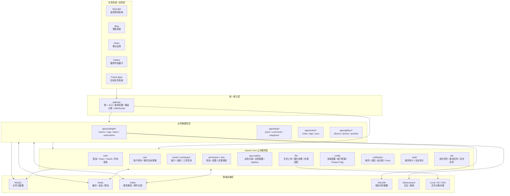
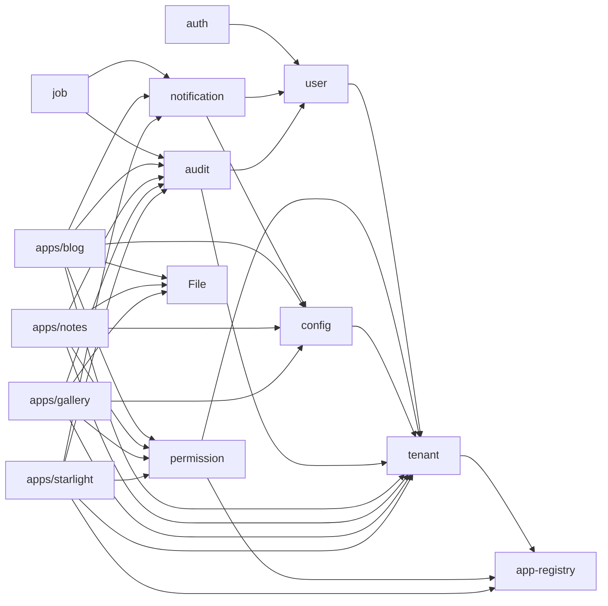

# Darwin Core 公共微服务规划

## 1. 背景与目标

Darwin 后续不应该只是 StarLight 的后端，而应该演进成一套可被多个业务系统复用的公共平台底座。当前已经存在的 `auth`、`user`、`file` 属于核心公共能力，但随着后续接入博客、笔记应用、摄影作品展示站点以及更多业务系统，Core 层需要补齐租户、权限、应用注册、配置、通知、审计、任务调度等基础能力。

本文档用于指导后续 `darwin-app/src/core/*` 微服务建设，目标是明确服务边界、优先级、依赖关系和最小可落地范围。

### 设计目标

- Core 层只承载所有业务系统都会复用的基础能力。
- StarLight、Blog、Notes、Gallery 等业务能力放在 `src/apps/*`，避免污染 Core。
- Core 服务保持稳定、克制、低业务耦合。
- 每个业务系统通过统一身份、租户、权限、文件、配置、通知、审计能力快速接入 Darwin。
- 服务间仍沿用 Node-Universe 微服务模式：Kafka transporter、Redis cacher、MySQL 元数据存储。

### 非目标

- 不把 `metrics`、`logs`、`subscription` 直接提升为 Core。它们目前更接近 StarLight 或商业化业务域。
- 不提前抽象评论、点赞、收藏、搜索等业务能力。除非 Blog、Notes、Gallery 多个系统都稳定复用后，再考虑公共化。
- 不在 Core 中写入具体业务页面、业务 UI 或具体应用流程。

## 2. 总体架构定位



## 3. 推荐目录结构

```text
darwin-app/
├── src/core/
│   ├── gateway/          # 已有：统一入口、路由、鉴权前置、WebSocket
│   ├── auth/             # 已有：登录、注册、Token、RSA、扫码登录
│   ├── user/             # 已有：用户资料、用户生命周期
│   ├── file/             # 已有：文件上传、处理、存储
│   ├── tenant/           # 规划：租户、组织、工作空间、成员关系
│   ├── permission/       # 规划：RBAC、权限点、资源授权
│   ├── app-registry/     # 规划：应用注册、应用能力、AppKey、菜单入口
│   ├── config/           # 规划：全局配置、租户配置、功能开关
│   ├── notification/     # 规划：邮件、短信、站内信、Push
│   ├── audit/            # 规划：操作审计、安全审计
│   └── job/              # 规划：定时任务、重试任务、异步任务
│
├── src/apps/
│   ├── starlight/
│   ├── blog/
│   ├── notes/
│   └── gallery/
│
└── src/db/
    ├── mysql/
    ├── es/
    └── ...
```

## 4. Core 服务边界规划

### 4.1 `tenant` / `workspace`

`tenant` 是未来所有业务系统的数据隔离地基。StarLight、Blog、Notes、Gallery 都需要知道当前资源属于哪个租户、组织或工作空间。

#### 职责

- 管理租户、组织、工作空间。
- 管理成员关系、成员状态、邀请关系。
- 管理用户在不同租户下的身份。
- 提供业务系统接入时的租户上下文。
- 支持个人空间和团队空间两类场景。

#### 不负责

- 不负责登录认证。
- 不负责具体权限判断。
- 不负责业务资源本身，例如文章、笔记、照片、指标。

#### 核心模型建议

```text
Tenant
Workspace
TenantMember
WorkspaceMember
Invitation
TenantApplication
```

#### 典型接口

```text
tenant.v1.createTenant
tenant.v1.getTenant
tenant.v1.listMyTenants
tenant.v1.updateTenant
tenant.v1.addMember
tenant.v1.removeMember
tenant.v1.updateMemberRole
tenant.v1.createInvitation
tenant.v1.acceptInvitation
tenant.v1.listTenantApplications
```

#### 典型事件

```text
tenant.created
tenant.updated
tenant.deleted
tenant.member.added
tenant.member.removed
tenant.application.enabled
tenant.application.disabled
```

### 4.2 `permission` / `rbac`

`auth` 只回答“你是谁”，`permission` 回答“你能做什么”。权限服务必须独立，否则权限逻辑会散落在各业务服务里。

#### 职责

- 管理角色、权限点、资源授权策略。
- 管理用户、角色、租户、应用之间的授权关系。
- 提供统一的 `permission.check` 能力。
- 支持系统级、租户级、应用级、资源级权限。

#### 不负责

- 不负责登录、Token 签发。
- 不负责资源 CRUD。
- 不负责业务规则判断，只负责权限判定。

#### 权限命名建议

```text
<app>.<resource>.<action>
```

示例：

```text
starlight.metrics.system.read
starlight.alert.resolve
blog.post.create
blog.post.publish
notes.note.private.read
gallery.photo.upload
gallery.album.publish
core.file.upload
core.tenant.member.manage
```

#### 核心模型建议

```text
Permission
Role
RolePermission
UserRoleBinding
TenantRoleBinding
ResourcePolicy
```

#### 典型接口

```text
permission.v1.check
permission.v1.batchCheck
permission.v1.createRole
permission.v1.updateRole
permission.v1.assignRole
permission.v1.revokeRole
permission.v1.listPermissions
permission.v1.listUserRoles
permission.v1.bindResourcePolicy
```

#### 典型事件

```text
permission.role.created
permission.role.updated
permission.role.deleted
permission.role.assigned
permission.role.revoked
permission.policy.updated
```

### 4.3 `app-registry`

Darwin 未来会承载多个应用，所以需要一个服务统一管理应用、应用能力、应用入口和应用接入凭证。

#### 职责

- 管理 Darwin 下所有业务应用。
- 管理应用启用状态、入口地址、图标、描述、菜单。
- 管理应用权限命名空间。
- 管理应用级 AppKey / ClientId / Callback URL。
- 支持租户级应用启用/禁用。

#### 不负责

- 不负责具体应用业务逻辑。
- 不负责用户权限判定，只提供应用权限声明。
- 不负责订阅计费，只提供应用元数据。

#### 核心模型建议

```text
Application
ApplicationCapability
ApplicationMenu
ApplicationCredential
TenantApplication
ApplicationPermissionManifest
```

#### 典型接口

```text
app-registry.v1.registerApplication
app-registry.v1.updateApplication
app-registry.v1.listApplications
app-registry.v1.getApplication
app-registry.v1.enableApplicationForTenant
app-registry.v1.disableApplicationForTenant
app-registry.v1.generateCredential
app-registry.v1.verifyCredential
app-registry.v1.getApplicationManifest
```

#### 典型事件

```text
application.registered
application.updated
application.enabled
tenant.application.enabled
tenant.application.disabled
application.credential.rotated
```

### 4.4 `config`

统一管理配置，避免每个业务服务各自维护散乱配置。

#### 职责

- 管理全局配置、租户配置、应用配置。
- 管理 Feature Flag。
- 支持配置版本、灰度、回滚。
- 为业务服务提供配置读取与缓存失效事件。

#### 不负责

- 不存储敏感密钥明文。敏感配置后续应接入专门的 secret 机制。
- 不处理业务逻辑。

#### 核心模型建议

```text
ConfigItem
ConfigNamespace
FeatureFlag
ConfigRevision
```

#### 典型接口

```text
config.v1.get
config.v1.set
config.v1.batchGet
config.v1.listByNamespace
config.v1.publishRevision
config.v1.rollbackRevision
config.v1.evaluateFeatureFlag
```

#### 典型事件

```text
config.updated
config.deleted
config.revision.published
feature.enabled
feature.disabled
```

### 4.5 `notification`

通知能力会被 StarLight 告警、订阅账单、博客评论、笔记协作、摄影站互动等多个业务复用。

#### 职责

- 统一发送邮件、短信、站内信、Push。
- 管理通知模板。
- 管理通知渠道、发送记录、重试。
- 支持业务事件驱动通知。

#### 不负责

- 不决定业务是否应该通知，只执行通知投递。
- 不替代业务事件服务。

#### 核心模型建议

```text
NotificationTemplate
NotificationChannel
NotificationMessage
NotificationDelivery
UserNotificationPreference
```

#### 典型接口

```text
notification.v1.send
notification.v1.sendBatch
notification.v1.createTemplate
notification.v1.updateTemplate
notification.v1.listDeliveries
notification.v1.markInAppRead
notification.v1.updatePreference
```

#### 典型事件

```text
notification.requested
notification.sent
notification.failed
notification.read
```

### 4.6 `audit`

审计服务记录关键操作，用于安全追踪、问题排查和后续管理后台展示。

#### 职责

- 记录登录、权限变更、租户变更、文件操作、业务关键操作。
- 提供审计查询、筛选、导出。
- 区分操作审计和安全审计。
- 支持业务系统通过事件或 API 写入审计记录。

#### 不负责

- 不代替业务日志系统。
- 不存储大规模应用运行日志；运行日志仍应进入 logs/Elasticsearch。

#### 核心模型建议

```text
AuditLog
SecurityEvent
AuditActor
AuditTarget
AuditExportTask
```

#### 典型接口

```text
audit.v1.record
audit.v1.search
audit.v1.getDetail
audit.v1.export
audit.v1.listSecurityEvents
```

#### 典型事件

```text
audit.recorded
security.event.detected
security.event.resolved
```

### 4.7 `job` / `scheduler`

统一承载定时任务、后台任务、重试任务，避免每个服务都散落自己的定时器。

#### 职责

- 管理定时任务定义。
- 管理异步任务、重试、失败记录。
- 支持一次性任务、周期任务、延迟任务。
- 为业务服务提供任务投递和状态查询。

#### 不负责

- 不写具体业务逻辑；业务逻辑仍在对应服务中执行。
- 不替代 Kafka transporter，只提供任务编排语义。

#### 核心模型建议

```text
JobDefinition
JobRun
JobAttempt
JobSchedule
DeadLetterTask
```

#### 典型接口

```text
job.v1.enqueue
job.v1.schedule
job.v1.cancel
job.v1.retry
job.v1.getStatus
job.v1.listRuns
```

#### 典型事件

```text
job.enqueued
job.started
job.completed
job.failed
job.retry.scheduled
```

## 5. 服务依赖关系建议



## 6. 分阶段实施计划

### P0：平台地基

优先建设会影响所有业务系统数据模型和权限模型的服务。

1. `tenant / workspace`
   - 建立租户、工作空间、成员关系。
   - 给现有用户模型补齐默认个人租户或默认工作空间。
   - 明确所有业务数据都必须带 `tenantId` 或 `workspaceId`。

2. `permission / rbac`
   - 建立权限命名规范。
   - 支持 `permission.check` 和 `permission.batchCheck`。
   - 为 StarLight 的系统指标权限、未来 Blog/Notes/Gallery 权限留出 namespace。

3. `app-registry`
   - 注册 `starlight`、`blog`、`notes`、`gallery` 等应用。
   - 管理应用 manifest、菜单入口、权限声明。
   - 支持租户级应用启用/禁用。

### P1：平台治理能力

这些服务不一定阻塞业务启动，但会提升平台长期可维护性。

4. `config`
   - 支持全局、租户、应用级配置。
   - 支持 Feature Flag。

5. `audit`
   - 先接入登录、权限、租户、文件、应用启用等关键操作。
   - 后续业务系统逐步接入。

6. `notification`
   - 先支持邮件和站内信。
   - 后续接入短信、Push、告警渠道。

### P2：后台任务与复用能力沉淀

7. `job / scheduler`
   - 承载账单生成、通知重试、过期邀请清理、文件清理等任务。

8. 可选公共能力沉淀
   - `search`：当 Blog、Notes、Gallery 都需要统一搜索时再抽象。
   - `comment`：当多个应用都需要评论体系时再抽象。
   - `interaction`：点赞、收藏、浏览历史等能力稳定复用后再抽象。

## 7. 数据与权限约定

### 7.1 所有业务数据必须有归属上下文

后续业务服务新增表时，原则上必须包含以下字段之一或多个：

```text
tenantId
workspaceId
applicationId
ownerUserId
```

建议默认规则：

- 个人内容：有 `tenantId`、`workspaceId`、`ownerUserId`。
- 团队内容：有 `tenantId`、`workspaceId`。
- 应用配置：有 `tenantId`、`applicationId`。
- 系统级配置：可没有 `tenantId`，但必须通过系统权限保护。

### 7.2 权限检查统一走 permission 服务

业务服务不应该自己散落复杂权限判断。推荐流程：

```text
Gateway/Auth 解析用户身份
业务服务拿到 userId + tenantId + action + resource
业务服务调用 permission.check
通过后执行业务逻辑
关键操作写入 audit
```

### 7.3 应用必须注册后接入

后续新增业务系统时，应先在 `app-registry` 注册：

```text
applicationId
name
displayName
description
icon
entryUrl
permissionNamespace
menuManifest
capabilities
```

## 8. 新业务系统接入流程

以 Blog 为例：

1. 在 `app-registry` 注册 `blog` 应用。
2. 在 `permission` 注册 Blog 权限点：
   - `blog.post.create`
   - `blog.post.update`
   - `blog.post.publish`
   - `blog.comment.manage`
3. 在 `tenant` 中启用 Blog 应用。
4. 在 `config` 中写入 Blog 默认配置。
5. 创建 `src/apps/blog/*` 业务微服务。
6. Blog 服务读取用户身份和租户上下文。
7. Blog 服务执行写操作前调用 `permission.check`。
8. Blog 服务上传封面图时调用 `file`。
9. Blog 服务关键操作写入 `audit`。
10. Blog 服务需要提醒时调用 `notification`。

Notes、Gallery、后续系统同理。

## 9. Core 服务实现模板建议

每个 Core 服务建议沿用现有微服务结构：

```text
service-name/
├── index.ts
├── constants/
│   └── index.ts
├── types/
│   └── index.ts
├── actions/
│   ├── index.ts
│   ├── create.ts
│   ├── read.ts
│   ├── update.ts
│   └── delete.ts
├── methods/
│   └── index.ts
├── events/
│   └── index.ts
├── validators/
│   └── index.ts
└── utils/
    └── index.ts
```

基础实现约定：

- Star namespace 统一使用 `darwin-app`。
- transporter 统一使用 Kafka。
- cacher 统一使用 Redis。
- 元数据统一通过 `DatabaseService` 写 MySQL。
- 对外 action 使用 `v1.*` 命名。
- 服务内事件使用 `<service>.<event>` 命名。
- 所有写操作必须有审计接入点。
- 所有跨租户读取必须显式校验权限。

## 10. 当前推荐结论

Darwin Core 的下一阶段建设重点是：

```text
P0: tenant -> permission -> app-registry
P1: config -> audit -> notification
P2: job -> search/comment/interaction 等复用能力
```

最先落地的应该是 `tenant` 和 `permission`，因为它们会影响所有后续业务系统的数据归属、权限模型和 API 设计。`app-registry` 紧随其后，用来让 StarLight、Blog、Notes、Gallery 以统一方式接入 Darwin。