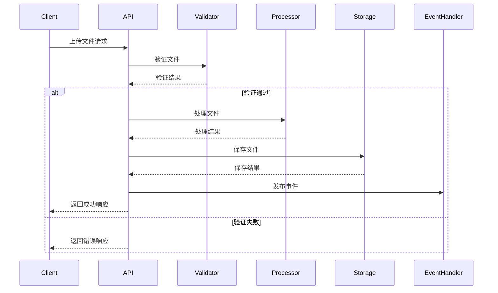

# File 微服务文档

## 概述

File 微服务是 darwin-app 项目中负责文件上传、处理、存储和管理的核心服务。基于 node-universe 框架构建，提供完整的文件生命周期管理功能。

## 服务架构

### 核心组件

```
src/core/file/
├── actions/           # API 接口实现
├── config/            # 配置管理
├── constants.ts       # 常量定义
├── events/            # 事件处理
├── methods/           # 内部方法
├── processors/        # 文件处理器
├── routes/            # 路由定义
├── storage/           # 存储适配器
├── tests/             # 测试文件
├── types/             # 类型定义
├── utils/             # 工具函数
├── validators/        # 文件验证器
└── index.ts           # 服务入口
```

### 设计模式

- **适配器模式**: 存储适配器支持多种存储后端
- **策略模式**: 文件处理策略可根据文件类型动态选择
- **观察者模式**: 事件驱动的文件操作通知
- **工厂模式**: 路由和处理器的创建

## API 接口

### 1. 文件上传 (v1.uploadFile)

**参数**:
```typescript
{
  file: string;        // Base64编码的文件内容
  filename: string;    // 文件名
  mimetype: string;    // MIME类型
  category?: string;   // 文件分类 (avatar|blogImage|document|general|other)
  userId?: string;     // 用户ID
  metadata?: object;   // 元数据
}
```

**响应**:
```typescript
{
  success: boolean;
  data: {
    fileId: string;
    filename: string;
    originalName: string;
    size: number;
    mimetype: string;
    category: FileCategory;
    url: string;
    thumbnailUrl?: string;
    metadata?: Record<string, any>;
    uploadedAt: Date;
  }
}
```

**功能特性**:
- 文件格式验证
- 大小限制检查
- 图片自动处理和压缩
- 缩略图生成
- 安全文件名生成
- 事件通知

### 2. 文件删除 (v1.deleteFile)

**接口**: `DELETE /api/file/v1.deleteFile`

**参数**:
```typescript
{
  filename: string;    // 文件名
  userId?: string;     // 用户ID
}
```

**响应**:
```typescript
{
  success: boolean;
  data: {
    filename: string;
    deleted: boolean;
  }
}
```

### 3. 文件信息查询 (v1.getFileInfo)

**接口**: `GET /api/file/v1.getFileInfo`

**参数**:
```typescript
{
  filename: string;    // 文件名
}
```

**响应**:
```typescript
{
  success: boolean;
  data: {
    filename: string;
    url: string;
    thumbnailUrl?: string;
    mimetype: string | null;
    exists: boolean;
  }
}
```

## 数据库设计

### 文件元数据存储

虽然当前实现主要使用文件系统存储，但设计支持数据库元数据管理：

```sql
-- 文件元数据表 (概念设计)
CREATE TABLE file_metadata (
  id VARCHAR(36) PRIMARY KEY,
  filename VARCHAR(255) NOT NULL,
  original_name VARCHAR(255) NOT NULL,
  size BIGINT NOT NULL,
  mimetype VARCHAR(100) NOT NULL,
  category ENUM('avatar', 'blogImage', 'document', 'general', 'other') NOT NULL,
  status ENUM('pending', 'processing', 'completed', 'failed', 'deleted') NOT NULL,
  user_id VARCHAR(36),
  url VARCHAR(500),
  thumbnail_url VARCHAR(500),
  checksum VARCHAR(64),
  tags JSON,
  custom_data JSON,
  uploaded_at TIMESTAMP DEFAULT CURRENT_TIMESTAMP,
  processed_at TIMESTAMP NULL,
  created_at TIMESTAMP DEFAULT CURRENT_TIMESTAMP,
  updated_at TIMESTAMP DEFAULT CURRENT_TIMESTAMP ON UPDATE CURRENT_TIMESTAMP,
  
  INDEX idx_user_id (user_id),
  INDEX idx_category (category),
  INDEX idx_status (status),
  INDEX idx_uploaded_at (uploaded_at)
);

-- 文件事件表
CREATE TABLE file_events (
  id VARCHAR(36) PRIMARY KEY,
  event_type VARCHAR(50) NOT NULL,
  file_id VARCHAR(36) NOT NULL,
  user_id VARCHAR(36),
  timestamp TIMESTAMP DEFAULT CURRENT_TIMESTAMP,
  data JSON,
  source VARCHAR(100),
  metadata JSON,
  
  INDEX idx_file_id (file_id),
  INDEX idx_user_id (user_id),
  INDEX idx_event_type (event_type),
  INDEX idx_timestamp (timestamp)
);

-- 文件错误日志表
CREATE TABLE file_errors (
  id VARCHAR(36) PRIMARY KEY,
  type ENUM('validation_error', 'upload_error', 'processing_error', 'storage_error', 'permission_error', 'not_found_error') NOT NULL,
  message TEXT NOT NULL,
  code VARCHAR(50),
  details JSON,
  timestamp TIMESTAMP DEFAULT CURRENT_TIMESTAMP,
  operation ENUM('upload', 'delete', 'process', 'validate', 'thumbnail'),
  file_id VARCHAR(36),
  
  INDEX idx_type (type),
  INDEX idx_timestamp (timestamp),
  INDEX idx_file_id (file_id)
);
```

### 数据库集成

当前使用 MySQL 作为主数据库，通过 `DatabaseService` 提供统一的数据访问接口：

```typescript
// 数据库服务初始化
const star = createStarWithDatabase(config, 'file-service');
await star.db.initialize({}, {
  enableSlowQueryLog: true,
  slowQueryThreshold: 1000,
});

// 配置管理
const configs = await star.db.config.getAllConfigList();
```

## 文件处理流程

### 上传流程



### 图片处理流程

1. **格式检测**: 验证图片格式和完整性
2. **尺寸调整**: 根据配置调整图片尺寸
3. **质量压缩**: 优化文件大小
4. **格式转换**: 统一转换为 WebP 格式
5. **缩略图生成**: 生成标准尺寸缩略图

## 存储策略

### 本地存储适配器

```typescript
class LocalStorageAdapter implements StorageAdapter {
  // 文件保存策略
  async save(file: Buffer, filename: string, category?: string, userId?: string): Promise<string>
  
  // 文件删除策略
  async delete(filename: string): Promise<boolean>
  
  // URL生成策略
  getUrl(filename: string): string
  
  // 文件存在检查
  async exists(filename: string): Promise<boolean>
}
```

### 文件组织结构

```
uploads/
├── avatars/           # 头像文件
├── blog/              # 博客图片
├── documents/         # 文档文件
├── general/           # 通用文件
└── thumbnails/        # 缩略图
```

### 安全特性

- **文件名安全化**: 防止路径遍历攻击
- **MIME类型验证**: 防止恶意文件上传
- **文件大小限制**: 防止资源耗尽
- **扩展名白名单**: 只允许安全的文件类型

## 配置管理

### 文件分类配置

```typescript
export const PROCESSING_PROFILES = {
  avatar: {
    maxSize: 5 * 1024 * 1024,        // 5MB
    allowedMimeTypes: ['image/jpeg', 'image/png', 'image/webp'],
    imageProcessing: {
      resize: { width: 200, height: 200, fit: 'cover' },
      quality: 85,
      format: 'webp'
    }
  },
  blogImage: {
    maxSize: 10 * 1024 * 1024,       // 10MB
    allowedMimeTypes: ['image/jpeg', 'image/png', 'image/webp', 'image/gif'],
    imageProcessing: {
      resize: { width: 1200, height: 800, fit: 'inside' },
      quality: 80,
      format: 'webp'
    }
  },
  document: {
    maxSize: 50 * 1024 * 1024,       // 50MB
    allowedMimeTypes: ['application/pdf', 'text/plain', 'application/msword']
  }
};
```

### 服务配置

```typescript
export const SERVICE_CONFIG = {
  REQUEST_TIMEOUT: 30000,           // 30秒
  MAX_RETRIES: 3,                   // 最大重试次数
  RETRY_DELAY: 1000,                // 重试延迟
  HEALTH_CHECK_INTERVAL: 30000      // 健康检查间隔
};
```

## 事件系统

### 事件类型

```typescript
export const FILE_EVENTS = {
  FILE_UPLOADED: 'file.uploaded',
  FILE_DELETED: 'file.deleted',
  FILE_PROCESSED: 'file.processed',
  FILE_ERROR: 'file.error',
  BATCH_UPLOAD_COMPLETED: 'file.batch.completed'
};
```

### 事件处理器

```typescript
class FileEventHandler {
  // 发布文件上传事件
  publishFileUploaded(fileId: string, userId: string, data: any): void
  
  // 发布文件删除事件
  publishFileDeleted(fileId: string, userId: string, filename: string): void
  
  // 发布文件错误事件
  publishFileError(fileId: string, userId: string, error: any): void
}
```

## 性能优化

### 缓存策略

- **文件元数据缓存**: 减少数据库查询
- **缩略图缓存**: 避免重复生成
- **配置缓存**: 提高配置读取性能

### 异步处理

- **图片处理**: 异步处理大图片
- **缩略图生成**: 后台生成缩略图
- **事件发布**: 异步事件通知

### 监控指标

```typescript
export const METRICS_CONFIG = {
  UPLOAD_SUCCESS_RATE: 'file.upload.success_rate',
  UPLOAD_DURATION: 'file.upload.duration',
  PROCESSING_DURATION: 'file.processing.duration',
  STORAGE_USAGE: 'file.storage.usage',
  ERROR_RATE: 'file.error.rate'
};
```

## 错误处理

### 错误类型

```typescript
export enum FileErrorType {
  VALIDATION_ERROR = 'validation_error',
  UPLOAD_ERROR = 'upload_error',
  PROCESSING_ERROR = 'processing_error',
  STORAGE_ERROR = 'storage_error',
  PERMISSION_ERROR = 'permission_error',
  NOT_FOUND_ERROR = 'not_found_error'
}
```

### 错误响应格式

```typescript
{
  success: false,
  data: {
    content: null,
    message: "错误描述",
    code: HttpResponseCode.ParamsError,
    success: false
  }
}
```

## 安全考虑

### 文件验证

- **MIME类型检查**: 验证文件真实类型
- **文件头验证**: 检查文件魔数
- **病毒扫描**: 集成病毒扫描引擎（可选）
- **内容过滤**: 检查敏感内容

### 访问控制

- **用户认证**: 要求用户登录
- **权限检查**: 验证文件访问权限
- **速率限制**: 防止滥用
- **IP黑名单**: 阻止恶意IP

## 扩展性设计

### 存储后端扩展

支持多种存储后端：
- 本地文件系统
- Amazon S3
- Google Cloud Storage
- Azure Blob Storage
- 阿里云OSS

### 处理器扩展

支持多种文件处理器：
- 图片处理器 (Sharp)
- 视频处理器 (FFmpeg)
- 文档处理器 (LibreOffice)
- 音频处理器

### 队列系统

支持异步任务队列：
- Redis队列
- RabbitMQ
- AWS SQS
- 内存队列

## 部署和运维

### Docker 部署

```dockerfile
FROM node:18-alpine
WORKDIR /app
COPY package*.json ./
RUN npm ci --only=production
COPY . .
EXPOSE 3000
CMD ["npm", "start"]
```

### 健康检查

```typescript
// 健康检查端点
GET /health

// 响应格式
{
  status: 'healthy' | 'unhealthy' | 'degraded',
  timestamp: Date,
  version: string,
  uptime: number,
  dependencies: {
    storage: boolean,
    cache: boolean,
    queue: boolean,
    database: boolean
  },
  metrics: {
    activeUploads: number,
    queueSize: number,
    errorRate: number,
    avgResponseTime: number
  }
}
```

### 监控和日志

- **结构化日志**: 使用 Pino 记录结构化日志
- **性能监控**: 集成 Prometheus 指标
- **错误追踪**: 集成 Sentry 错误追踪
- **链路追踪**: 支持 OpenTelemetry

## 最佳实践

### 开发建议

1. **类型安全**: 使用 TypeScript 确保类型安全
2. **错误处理**: 统一的错误处理和响应格式
3. **日志记录**: 详细的操作日志和错误日志
4. **测试覆盖**: 完整的单元测试和集成测试
5. **文档维护**: 及时更新API文档和架构文档

### 性能建议

1. **文件大小限制**: 合理设置文件大小限制
2. **并发控制**: 限制并发上传数量
3. **缓存策略**: 合理使用缓存减少IO操作
4. **异步处理**: 耗时操作使用异步处理
5. **资源清理**: 定期清理临时文件和过期文件

### 安全建议

1. **输入验证**: 严格验证所有输入参数
2. **文件扫描**: 对上传文件进行安全扫描
3. **访问控制**: 实施细粒度的访问控制
4. **审计日志**: 记录所有文件操作的审计日志
5. **加密存储**: 敏感文件使用加密存储

## 总结

File 微服务采用模块化、可扩展的架构设计，提供了完整的文件管理功能。通过适配器模式支持多种存储后端，通过事件驱动架构实现松耦合，通过完善的错误处理和监控确保服务稳定性。该设计既满足当前需求，又为未来扩展提供了良好的基础。